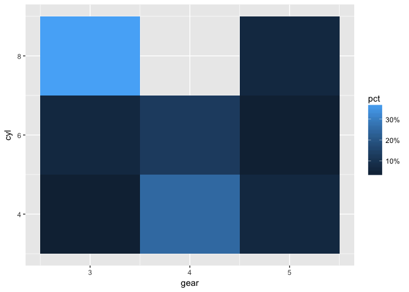
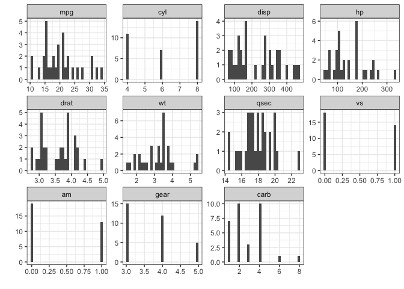

xplor
=====

A package of lightweight utility functions for assisting with interactive data exploration, particularly geared toward understanding record layouts of relational data (e.g., the grain of a table, mappings between primary and affiliate dimensions, extent of normalization/denormalization, etc.). NSE and SE versions of core functions are provided to facilitate interactive and programming use. Functions are designed to work well with `dplyr`.

Installation
------------

Install **xplor** from github with:

``` r
# install.packages("devtools")
devtools::install_github("xplor/rebelrebel04")
```

Core Functions
--------------

### cpf

Create **c**umulative **p**ercentile/**f**requency tables with `cpf`. The most common use case is interactive crosstabs (though note that the output frequency table is always in long format).

``` r
data(mtcars)
cpf(mtcars, gear)
##   gear  n cumsum  pct cumpct
## 1    3 15     15  47%    47%
## 2    4 12     27  38%    84%
## 3    5  5     32  16%   100%
## 4 ==== 32     NA 100%     NA
```

You can also request a lightly-formatted `kable` when running `cpf` within an Rmarkdown file:

``` r
cpf(mtcars, gear, kable = TRUE)
```

| gear |    n|  cumsum|   pct|  cumpct|
|:-----|----:|-------:|-----:|-------:|
| 3    |   15|      15|   47%|     47%|
| 4    |   12|      27|   38%|     84%|
| 5    |    5|      32|   16%|    100%|
| ==== |   32|      NA|  100%|      NA|

A nice feature is that you can pass `cpf` computed variables using bare variable names; optionally provide descriptive names for the table columns:

``` r
cpf(mtcars, carb >= 4)
##   carb >= 4  n cumsum  pct cumpct
## 1     FALSE 20     20  62%    62%
## 2      TRUE 12     32  38%   100%
## 3      ==== 32     NA 100%     NA

cpf(mtcars, has_cyl = !is.na(cyl))
##   has_cyl  n cumsum  pct cumpct
## 1    TRUE 32     32 100%   100%
## 2    ==== 32     NA 100%     NA
```

Optionally specify a weighting variable for frequencies:

``` r
cpf(mtcars, carb, wt = "cyl")
##   carb   n cumsum  pct cumpct
## 1    4  72     72  36%    36%
## 2    2  56    128  28%    65%
## 3    1  32    160  16%    81%
## 4    3  24    184  12%    93%
## 5    8   8    192   4%    97%
## 6    6   6    198   3%   100%
## 7 ==== 198     NA 100%     NA
```

A chi-square test can be requestd for frequency tables that have two or more dimensions:

``` r
cpf(mtcars, cyl > 4, hp > 123, chi_square = TRUE)
## Test for independence of all factors:
##  Chisq = 15, df = 1, p-value = 0.00012
##   cyl > 4 hp > 123  n cumsum  pct cumpct
## 1    TRUE     TRUE 15     15  47%    47%
## 2   FALSE    FALSE 11     26  34%    81%
## 3    TRUE    FALSE  6     32  19%   100%
## 4    ====     ==== 32     NA 100%     NA
```

`cpf` returns a dataframe containing the frequency table, which can be useful for downstream processing or plotting:

``` r
cpf(mtcars, gear, cyl, margin = FALSE) %>% 
  ggplot2::ggplot(ggplot2::aes(x = gear, y = cyl, fill = pct)) +
  ggplot2::geom_tile() +
  ggplot2::scale_fill_gradient(label = scales::percent)
```



The SE version of `cpf_` is provided in the event you have variable names built up through some other means:

``` r
vars <- names(mtcars)[grepl("^c", names(mtcars))]
cpf_(mtcars, .dots = vars)
##     cyl carb  n cumsum  pct cumpct
## 1     4    2  6      6  19%    19%
## 2     8    4  6     12  19%    38%
## 3     4    1  5     17  16%    53%
## 4     6    4  4     21  12%    66%
## 5     8    2  4     25  12%    78%
## 6     8    3  3     28   9%    88%
## 7     6    1  2     30   6%    94%
## 8     6    6  1     31   3%    97%
## 9     8    8  1     32   3%   100%
## 10 ==== ==== 32     NA 100%     NA
```

### has

`has` is a wrapper around the common pattern of using `cpf` to cross-tab missing value (`NA`) counts across multiple dimensions:

``` r
mtcars.na <- mtcars
set.seed(1234)
mtcars.na[runif(10, 1, nrow(mtcars.na)), "gear"] <- NA
mtcars.na[runif(5, 1, nrow(mtcars.na)), "cyl"] <- NA

has(mtcars.na, gear, cyl, carb, kable = TRUE)
```

| has\_gear | has\_cyl | has\_carb |    n|  cumsum|   pct|  cumpct|
|:----------|:---------|:----------|----:|-------:|-----:|-------:|
| TRUE      | TRUE     | TRUE      |   19|      19|   59%|     59%|
| FALSE     | TRUE     | TRUE      |    8|      27|   25%|     84%|
| TRUE      | FALSE    | TRUE      |    5|      32|   16%|    100%|
| ====      | ====     | ====      |   32|      NA|  100%|      NA|

``` r
# This is equivalent to:
# cpf(mtcars.na, has_gear = is.na(gear), has_cyl = is.na(cyl), has_carb = is.na(carb), kable = TRUE)
```

### ss

Produce a quick table of **s**ummary **s**tatistics with `ss`. The function accepts a named list of functions (specified as formulas) via the `funs` argument, with the default list covering the basics. If no variables are specified the table will summarize all numeric columns in the dataset. If `plot = TRUE` a facet-wrapped plot of histograms will be produced as a side-effect.

``` r
ss(mtcars, plot = TRUE, kable = TRUE)
```



| Variable |    N|  NAs|    Min|    P10|    Mean|  Median|     P90|     Max|      SD|    CV|
|:---------|----:|----:|------:|------:|-------:|-------:|-------:|-------:|-------:|-----:|
| mpg      |   32|    0|  10.40|  14.34|   20.09|   19.20|   30.09|   33.90|    6.03|  0.30|
| cyl      |   32|    0|   4.00|   4.00|    6.19|    6.00|    8.00|    8.00|    1.79|  0.29|
| disp     |   32|    0|  71.10|  80.61|  230.72|  196.30|  396.00|  472.00|  123.94|  0.54|
| hp       |   32|    0|  52.00|  66.00|  146.69|  123.00|  243.50|  335.00|   68.56|  0.47|
| drat     |   32|    0|   2.76|   3.01|    3.60|    3.70|    4.21|    4.93|    0.53|  0.15|
| wt       |   32|    0|   1.51|   1.96|    3.22|    3.33|    4.05|    5.42|    0.98|  0.30|
| qsec     |   32|    0|  14.50|  15.53|   17.85|   17.71|   19.99|   22.90|    1.79|  0.10|
| vs       |   32|    0|   0.00|   0.00|    0.44|    0.00|    1.00|    1.00|    0.50|  1.15|
| am       |   32|    0|   0.00|   0.00|    0.41|    0.00|    1.00|    1.00|    0.50|  1.23|
| gear     |   32|    0|   3.00|   3.00|    3.69|    4.00|    5.00|    5.00|    0.74|  0.20|
| carb     |   32|    0|   1.00|   1.00|    2.81|    2.00|    4.00|    8.00|    1.62|  0.57|

A `dplyr`-grouped dataframe can be passed to produce a dimensional summary table:

``` r
library(dplyr)
mtcars %>% 
  group_by(cyl) %>% 
  ss(kable = TRUE)
```

| Variable |    N|  NAs|    Min|    P10|    Mean|  Median|     P90|     Max|      SD|    CV|
|:---------|----:|----:|------:|------:|-------:|-------:|-------:|-------:|-------:|-----:|
| mpg      |   32|    0|  10.40|  14.34|   20.09|   19.20|   30.09|   33.90|    6.03|  0.30|
| cyl      |   32|    0|   4.00|   4.00|    6.19|    6.00|    8.00|    8.00|    1.79|  0.29|
| disp     |   32|    0|  71.10|  80.61|  230.72|  196.30|  396.00|  472.00|  123.94|  0.54|
| hp       |   32|    0|  52.00|  66.00|  146.69|  123.00|  243.50|  335.00|   68.56|  0.47|
| drat     |   32|    0|   2.76|   3.01|    3.60|    3.70|    4.21|    4.93|    0.53|  0.15|
| wt       |   32|    0|   1.51|   1.96|    3.22|    3.33|    4.05|    5.42|    0.98|  0.30|
| qsec     |   32|    0|  14.50|  15.53|   17.85|   17.71|   19.99|   22.90|    1.79|  0.10|
| vs       |   32|    0|   0.00|   0.00|    0.44|    0.00|    1.00|    1.00|    0.50|  1.15|
| am       |   32|    0|   0.00|   0.00|    0.41|    0.00|    1.00|    1.00|    0.50|  1.23|
| gear     |   32|    0|   3.00|   3.00|    3.69|    4.00|    5.00|    5.00|    0.74|  0.20|
| carb     |   32|    0|   1.00|   1.00|    2.81|    2.00|    4.00|    8.00|    1.62|  0.57|

Pass a custom list of summary functions as formulas on `x`:

``` r
mtcars %>% 
  ss(
    funs = list(
      "variance" = ~var(x, na.rm = TRUE), 
      "skewness" = ~moments::skewness(x, na.rm = TRUE), 
      "kurtosis" = ~moments::kurtosis(x, na.rm = TRUE)
    ), 
    kable = TRUE
  )
```

| Variable |  variance|  skewness|  kurtosis|
|:---------|---------:|---------:|---------:|
| mpg      |     36.32|      0.64|      2.80|
| cyl      |      3.19|     -0.18|      1.32|
| disp     |  15360.80|      0.40|      1.91|
| hp       |   4700.87|      0.76|      3.05|
| drat     |      0.29|      0.28|      2.44|
| wt       |      0.96|      0.44|      3.17|
| qsec     |      3.19|      0.39|      3.55|
| vs       |      0.25|      0.25|      1.06|
| am       |      0.25|      0.38|      1.15|
| gear     |      0.54|      0.55|      2.06|
| carb     |      2.61|      1.10|      4.54|

### dup

Check for duplicate cases in a dataframe with `dup`:

``` r
dup(mtcars, gear, cyl)
## 
## 
## isDup     n   cumsum    pct   cumpct
## ------  ---  -------  -----  -------
## TRUE     30       30    94%      94%
## FALSE     2       32     6%     100%
## ====     32       NA   100%       NA
```

`dup` invisibly returns the original dataframe filtered to duplicate rows, with a variable `.n` attached indicating the number of duplicates:

``` r
print(dup(mtcars, disp))
## 
## 
## isDup     n   cumsum    pct   cumpct
## ------  ---  -------  -----  -------
## FALSE    23       23    72%      72%
## TRUE      9       32    28%     100%
## ====     32       NA   100%       NA
## # A tibble: 9 × 12
##     mpg   cyl  disp    hp  drat    wt  qsec    vs    am  gear  carb    .n
##   <dbl> <dbl> <dbl> <dbl> <dbl> <dbl> <dbl> <dbl> <dbl> <dbl> <dbl> <int>
## 1  16.4     8 275.8   180  3.07 4.070 17.40     0     0     3     3     3
## 2  17.3     8 275.8   180  3.07 3.730 17.60     0     0     3     3     3
## 3  15.2     8 275.8   180  3.07 3.780 18.00     0     0     3     3     3
## 4  21.0     6 160.0   110  3.90 2.620 16.46     0     1     4     4     2
## 5  21.0     6 160.0   110  3.90 2.875 17.02     0     1     4     4     2
## 6  19.2     6 167.6   123  3.92 3.440 18.30     1     0     4     4     2
## 7  17.8     6 167.6   123  3.92 3.440 18.90     1     0     4     4     2
## 8  18.7     8 360.0   175  3.15 3.440 17.02     0     0     3     2     2
## 9  14.3     8 360.0   245  3.21 3.570 15.84     0     0     3     4     2
```

A weight can be supplied to generate weighted duplication rates. This can be useful to determine if duplication is limited to low-frequency cases when weighting by a separate frequency variable:

``` r
dup(mtcars, disp, wt = "mpg")
## 
## 
## isDup      n   cumsum    pct   cumpct
## ------  ----  -------  -----  -------
## FALSE    482      482    75%      75%
## TRUE     161      643    25%     100%
## ====     643       NA   100%       NA
```

### mapping

For dimensions `x` and `y` in a dataset, there may be only one unique value of `y` associated with each unique value of `x`, or there may be multiple unique values of `y` associated with each unique value of `x`. `mapping` summarizes the association between `x` and `y` in a dataset, specified as a formula `x ~ y`:

``` r
mapping(cyl ~ gear, mtcars)
##   unique_ys n_xs pct_xs
## 1         1    1    33%
## 2         2    2    67%
```

In this example, there is one value of the "x" variable `cyl` that has a single unique "y" (`gear`) value associated with it, and two values of `cyl` that each have two unique `gear` values associated with them.

### findGrain

Often with a new dataset, you may not know the grain of the table (i.e., the combination of dimensions at which cases are unique). This function searches through candidate dimensions and ranks the top combinations in descending degree of de-duplication (aka normalization). In theory, the true grain of a table would be defined by the smallest combination of dimensions that yields 0 duplicates.

``` r
data(sleep)
findGrain(sleep, group, ID)
##   n_keys       keys duplicates
## 1      2 group * ID          0
## 2      1         ID         10
## 3      1      group         18
```

### vjoin

Verbose join wrapper around `dplyr` join functions to provide diagnostic output. Joined result is returned invisibly.

``` r
a <- mtcars[1:10, c("hp", "mpg", "disp")]
b <- mtcars[11:15, c("hp", "cyl")]
vjoin(a, b, "hp")
## a LEFT JOIN b ON hp
## SET a:   10 obs  3 variables 8 unique keys   1 keys with duplicates
## SET b:   5 obs   2 variables 3 unique keys   1 keys with duplicates
## KEYS IN a AND b: 1
## KEYS IN a NOT b: 7
## KEYS IN b NOT a: 2
## Result:  10 obs  6 variables 8 unique keys   1 keys with duplicates
## Match Table (unweighted):
##   .in_a .in_b  n cumsum  pct cumpct
## 1  TRUE FALSE  9      9  90%    90%
## 2  TRUE  TRUE  1     10  10%   100%
## 3  ====  ==== 10     NA 100%     NA
```

Match rates can be weighted:

``` r
vjoin(a, b, "hp", wt = "disp")
## a LEFT JOIN b ON hp
## SET a:   10 obs  3 variables 8 unique keys   1 keys with duplicates
## SET b:   5 obs   2 variables 3 unique keys   1 keys with duplicates
## KEYS IN a AND b: 1
## KEYS IN a NOT b: 7
## KEYS IN b NOT a: 2
## Result:  10 obs  6 variables 8 unique keys   1 keys with duplicates
## Match Table (weighted by disp):
##   .in_a .in_b     n cumsum  pct cumpct
## 1  TRUE FALSE 1,918  1,918  92%    92%
## 2  TRUE  TRUE   168  2,086   8%   100%
## 3  ====  ==== 2,086     NA 100%     NA
```
