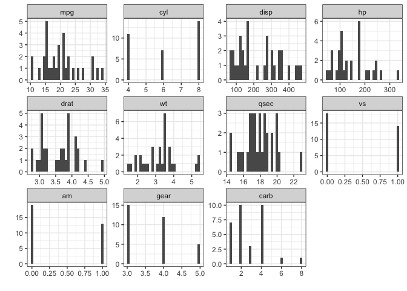

xplor
=====

A package of utility functions for assisting with interactive data exploration, particularly geared toward understanding record layouts of relational data (e.g., the grain of a table, mappings between primary and affiliate dimensions, extent of normalization/denormalization, etc.). NSE and SE versions of core functions are provided to facilitate interactive and programming use.

Installation
------------

Install **xplor** from github with:

``` r
# install.packages("devtools")
devtools::install_github("xplor/rebelrebel04")
```

Core Functions
--------------

### cpf

`cpf` provides a quick frequency/percentile summary table for a dataset by one or more grouping variables. The most common use case is interactive crosstabs (though note that the output frequency table is always in long format).

``` r
data(mtcars)
cpf(mtcars, gear)
##   gear  n cumsum  pct cumpct
## 1    3 15     15  47%    47%
## 2    4 12     27  38%    84%
## 3    5  5     32  16%   100%
## 4 ==== 32     NA 100%     NA
```

You can also request a lightly-formatted `kable` when running `cpf` within an Rmarkdown file:

``` r
cpf(mtcars, gear, kable = TRUE)
```

| gear |    n|  cumsum|   pct|  cumpct|
|:-----|----:|-------:|-----:|-------:|
| 3    |   15|      15|   47%|     47%|
| 4    |   12|      27|   38%|     84%|
| 5    |    5|      32|   16%|    100%|
| ==== |   32|      NA|  100%|      NA|

A nice feature is that you can pass `cpf` computed variables using bare variable names:

``` r
cpf(mtcars, carb >= 4)
##   carb >= 4  n cumsum  pct cumpct
## 1     FALSE 20     20  62%    62%
## 2      TRUE 12     32  38%   100%
## 3      ==== 32     NA 100%     NA

cpf(mtcars, is.na(cyl))
##   is.na(cyl)  n cumsum  pct cumpct
## 1      FALSE 32     32 100%   100%
## 2       ==== 32     NA 100%     NA
```

The SE version of `cpf_` is provided in the event you have variable names built up through some other means:

``` r
vars <- names(mtcars)[grepl("^c", names(mtcars))]
cpf_(mtcars, .dots = vars)
##     cyl carb  n cumsum  pct cumpct
## 1     4    2  6      6  19%    19%
## 2     8    4  6     12  19%    38%
## 3     4    1  5     17  16%    53%
## 4     6    4  4     21  12%    66%
## 5     8    2  4     25  12%    78%
## 6     8    3  3     28   9%    88%
## 7     6    1  2     30   6%    94%
## 8     6    6  1     31   3%    97%
## 9     8    8  1     32   3%   100%
## 10 ==== ==== 32     NA 100%     NA
```

### ss

Produce a quick table of **s**ummary **s**tatistics with `ss`. The function accepts a named list of functions via the `funs` argument, with the default list covering the basics. If no variables are specified the table will summarize all numeric columns in the dataset. If `plot = TRUE` a facet-wrapped plot of histograms will be produced as a side-effect.

``` r
ss(mtcars, plot = TRUE, kable = TRUE)
```



| Var  |    Min|  Ptile10|    Mean|  Median|  Ptile90|     Max|      SD|    CV|
|:-----|------:|--------:|-------:|-------:|--------:|-------:|-------:|-----:|
| mpg  |  10.40|    14.34|   20.09|   19.20|    30.09|   33.90|    6.03|  0.30|
| cyl  |   4.00|     4.00|    6.19|    6.00|     8.00|    8.00|    1.79|  0.29|
| disp |  71.10|    80.61|  230.72|  196.30|   396.00|  472.00|  123.94|  0.54|
| hp   |  52.00|    66.00|  146.69|  123.00|   243.50|  335.00|   68.56|  0.47|
| drat |   2.76|     3.01|    3.60|    3.70|     4.21|    4.93|    0.53|  0.15|
| wt   |   1.51|     1.96|    3.22|    3.33|     4.05|    5.42|    0.98|  0.30|
| qsec |  14.50|    15.53|   17.85|   17.71|    19.99|   22.90|    1.79|  0.10|
| vs   |   0.00|     0.00|    0.44|    0.00|     1.00|    1.00|    0.50|  1.15|
| am   |   0.00|     0.00|    0.41|    0.00|     1.00|    1.00|    0.50|  1.23|
| gear |   3.00|     3.00|    3.69|    4.00|     5.00|    5.00|    0.74|  0.20|
| carb |   1.00|     1.00|    2.81|    2.00|     4.00|    8.00|    1.62|  0.57|

### mapping

For dimensions `x` and `y` in a dataset, there may be only one unique value of `y` associated with each unique value of `x`, or there may be multiple unique values of `y` associated with each unique value of `x`. `mapping` summarizes the association between `x` and `y` in a dataset, specified as a formula `x ~ y`:

``` r
mapping(cyl ~ gear, mtcars)
##   unique_ys n_xs pct_xs
## 1         1    1    33%
## 2         2    2    67%
```

In this example, there is one value of the "x" variable `cyl` that has a single unique "y" (`gear`) value associated with it, and two values of `cyl` that each have two unique `gear` values associated with them.

### findGrain

Often with a new dataset, you may not know the grain of the table (i.e., the combination of dimensions at which cases are unique). This function searches through candidate dimensions and ranks the top combinations in descending degree of de-duplication (aka normalization). In theory, the true grain of a table would be defined by the smallest combination of dimensions that yields 0 duplicates.

``` r
data(sleep)
findGrain(sleep, group, ID)
##   n_keys       keys duplicates
## 1      2 group * ID          0
## 2      1         ID         10
## 3      1      group         18
```
